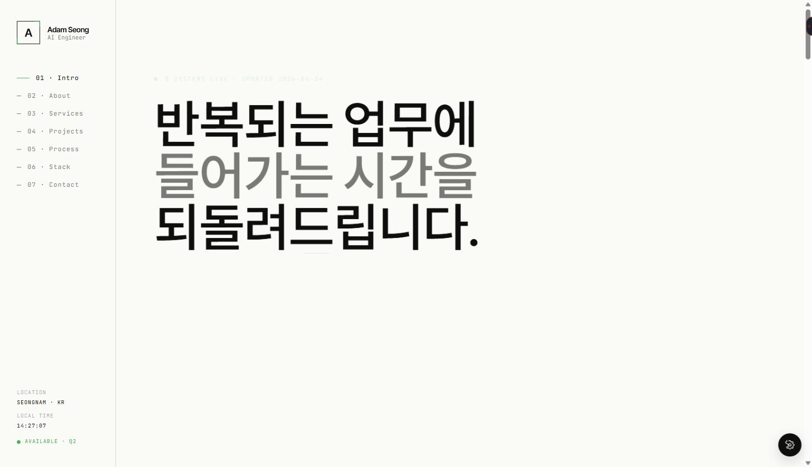

<div align="center">


<br />

<a href="https://adam-1228.github.io/adam-seong-portfolio/">
  
</a>
<a href="https://adam-1228.github.io/adam-seong-portfolio/Adam_AI_Portfolio_final.pdf">
  
</a>
<a href="mailto:giha1205@gmail.com">
  
</a>


<br />
<br />

<a href="#english-version">English Version</a>

</div>

---

## 소개

AI 엔지니어 Adam Seong입니다.<br />
LLM 에이전트, 업무 자동화, 로컬 데스크톱 제품, 게임/3D 프로토타입을 아이디어 단계에서 실제 릴리즈까지 이어가는 작업에 집중합니다.

Claude, Codex, OpenAI, Gemini, Groq 같은 AI 툴을 단순 코드 생성기가 아니라 **리서치, 설계, 구현, 검증, 문서화까지 이어지는 엔지니어링 워크플로우**로 사용합니다.

---

## 제품 증거

| 제품 | 상태 | 증거 | 주요 스택 |
|---|---:|---:|---|
| **ADAM Orbit** | `릴리즈` | `v10.2.6 · 452 passed` | Windows · OpenAPI · SQLite · Release QA |
| **Three Doors of Fate** | `APP STORE 출시` | `iOS v1.0.5` | Unity 6 · C# · iOS · Game Center |
| **나라먹기** | `APP STORE 출시` | `iOS v1.0.3` | React · Phaser · Capacitor · iOS |
| **AI 세일즈 자동화** | `운영 중` | `리드 전환율 +32%` | LangGraph · Gemini · SendGrid · AWS |
| **AI 툴 기반 프로토타입** | `제작 중` | AI-assisted product workflow | Claude · Codex · OpenAI · Gemini |
| **네일샵 예산 대시보드** | `운영 중` | 4년 재무 흐름 시각화 | Streamlit · Sheets · Plotly · pandas |

---

## 출시 게임 · Three Doors of Fate

<table>
<tr>
<td width="220" align="center">
  
</td>
<td valign="top">

### 세 문을 넘는 다크 판타지 카드 RPG

**세 개의 문, 세 명의 계약자, 매번 달라지는 여정 · App Store v1.0.5 정식 출시**

세 개의 문 가운데 하나를 선택하고, 카드와 유물로 위험을 돌파하는 턴제 로그라이크입니다. 도박사, 예언가, 추방자 중 한 명과 계약해 적의 의도를 읽고 자신만의 결말에 도달하세요.

<a href="https://apps.apple.com/kr/app/three-doors-of-fate/id6798086296">
  
</a>

</td>
</tr>
</table>

**제품 증거**<br />
`iOS v1.0.5` · `iPhone / iPad` · `Game Center 업적·리더보드` · `Unity 6`

<div align="center">
  
  
  
</div>

---

## 출시 게임 · 나라먹기

<table>
<tr>
<td width="150" align="center">
  
</td>
<td valign="top">

### 평범한 시민에서 세계 의장까지

**허구 정치 풍자 방치형 RPG · App Store v1.0.3 정식 출시**

명함 한 장으로 시작해 후원회, 국회, 대통령 연임을 거쳐 세계 의장까지 성장합니다. 빠른 공작은 수익을 만들지만 스캔들 뉴스와 시각적 후폭풍도 함께 남습니다.

<a href="https://apps.apple.com/kr/app/%EB%82%98%EB%9D%BC%EB%A8%B9%EA%B8%B0/id6791886200">
  
</a>

</td>
</tr>
</table>

**담당 범위:** `1인 기획 · 게임 디자인 · 제작 · 엔지니어링 · QA · App Store 배포`

- **세계관과 게임 디자인** — 풍자 세계관, 방치 경제, 시민에서 세계 의장까지의 장기 성장, 공작과 후폭풍 루프를 설계했습니다.
- **콘텐츠와 비주얼 제작** — 뉴스 96종, 엔딩 18종, 보좌진 6명, 권력 도구 12종과 생성형 AI 기반 아트·사운드 제작 흐름을 구축했습니다.
- **제품 파이프라인** — React, TypeScript, Phaser, Zustand로 게임을 구현하고 Capacitor로 iOS 네이티브 기능과 연결했습니다.
- **출시 엔지니어링** — Game Center/iCloud 저장, 자동 회귀 검증, 시뮬레이터·실기기 QA, TestFlight, App Review와 공개 배포를 완료했습니다.

**제작 파이프라인**<br />
`아이디어 → 게임 디자인 → 콘텐츠·아트 파이프라인 → 구현 → QA → App Store`

**제품 증거**<br />
`iOS v1.0.3` · `뉴스 96종` · `엔딩 18종` · `보좌진 6명` · `권력 도구 12종`

<div align="center">
  
  
  
</div>

---

## AI 툴체인 워크플로우

<table>
<tr>
<td width="50%" valign="top">

### 리서치와 설계

`Claude` · `OpenAI` · `Gemini`

- 요구사항 정리와 문제 정의
- 도메인 리서치와 기술 비교
- 시스템 설계 방향 검토
- 문서, 제안서, 포트폴리오 구조화

</td>
<td width="50%" valign="top">

### 구현과 반복 개선

`Codex` · `Claude` · `Groq`

- 코드 작성과 리팩터링
- UI/문서 반복 개선
- 테스트 계획과 회귀 검토
- 릴리즈 노트와 검증 기록 작성

</td>
</tr>
</table>

---

## 최근 작업

### AI 시스템

- LangGraph 기반 멀티 에이전트 세일즈 자동화
- Human-in-the-loop 기반 LLM 어시스턴트 워크플로우
- 시장, 뉴스, API 신호를 다루는 실시간 데이터 파이프라인
- Streamlit과 Google Sheets 기반 비즈니스 운영 대시보드

### 제품 / 게임 / 툴

- **ADAM Orbit** - Windows 데스크톱 자동매매 클라이언트
- **Last One or Nothing** - Unity 생존 호러 프로토타입
- **The Gray Maze** - Three.js / Electron 3D 미로 프로토타입
- **Three Doors of Fate** - Unity 6 다크 판타지 카드 RPG · App Store v1.0.5 출시
- **Unreal Gray Maze** - Unreal C++ 프로토타입

---

## 현재 집중 영역

```text
AI 제품 릴리즈          ██████████░░  80%
LLM 에이전트 시스템     █████████░░░  75%
데스크톱 자동화         ████████░░░░  70%
게임 / 3D 프로토타입    ███████░░░░░  60%
```

---

## 기술 스택

### AI / LLM


### 언어


### 앱 / 데이터


### 백엔드 / 인프라


### 게임 / 3D


---

## 포트폴리오 미리보기

<div align="center">

<a href="https://adam-1228.github.io/adam-seong-portfolio/">
  
</a>

</div>

---

## 연락

| | |
| :--- | :--- |
| **이메일** | [giha1205@gmail.com](mailto:giha1205@gmail.com) |
| **위치** | Seongnam, Republic of Korea |
| **가능 일정** | 2026 Q3 · 1-2개 프로젝트 가능 |
| **포트폴리오** | [adam-1228.github.io/adam-seong-portfolio](https://adam-1228.github.io/adam-seong-portfolio/) |

---

## English Version

## About

I am Adam Seong, an AI engineer and product builder.<br />
I focus on shipping LLM agents, business automation systems, local desktop products, and game/3D prototypes from idea to release.

I use AI tools such as Claude, Codex, OpenAI, Gemini, and Groq as an engineering workflow for **research, architecture, implementation, QA, and documentation**, not just as code generators.

---

## Product Proof

| Product | Status | Evidence | Main Stack |
|---|---:|---:|---|
| **ADAM Orbit** | `RELEASED` | `v10.2.6 · 452 passed` | Windows · OpenAPI · SQLite · Release QA |
| **Three Doors of Fate** | `APP STORE RELEASE` | `iOS v1.0.5` | Unity 6 · C# · iOS · Game Center |
| **Nation Eater** | `APP STORE RELEASE` | `iOS v1.0.3` | React · Phaser · Capacitor · iOS |
| **AI Sales Automation** | `LIVE` | `Lead conversion +32%` | LangGraph · Gemini · SendGrid · AWS |
| **AI Tool Prototypes** | `BUILDING` | AI-assisted product workflow | Claude · Codex · OpenAI · Gemini |
| **Nail Shop Dashboard** | `LIVE` | 4-year finance view | Streamlit · Sheets · Plotly · pandas |

---

## Shipped Game · Three Doors of Fate

<table>
<tr>
<td width="220" align="center">
  
</td>
<td valign="top">

### A dark-fantasy card RPG beyond three doors

**Three doors, three characters, and a different journey every time · App Store v1.0.5 live release**

Choose one of three doors and survive the risks beyond them with cards and relics. Make a pact with the Gambler, Seer, or Exile, read each enemy's intent, and fight toward an ending of your own.

<a href="https://apps.apple.com/kr/app/three-doors-of-fate/id6798086296">
  
</a>

</td>
</tr>
</table>

**Product evidence**<br />
`iOS v1.0.5` · `iPhone / iPad` · `Game Center achievements and leaderboards` · `Unity 6`

<div align="center">
  
  
  
</div>

---

## Shipped Game · Nation Eater

<table>
<tr>
<td width="150" align="center">
  
</td>
<td valign="top">

### From ordinary citizen to world chair

**Fictional political-satire idle RPG · App Store v1.0.3 live release**

Start with one business card, build a support machine, enter parliament, win repeat presidential terms, and climb toward the world chair. Every profitable shortcut can leave a scandal chain and a visible aftermath.

<a href="https://apps.apple.com/kr/app/%EB%82%98%EB%9D%BC%EB%A8%B9%EA%B8%B0/id6791886200">
  
</a>

</td>
</tr>
</table>

**Ownership:** `Solo product planning · game design · production · engineering · QA · App Store release`

- **World and game design** — Designed the satirical setting, idle economy, citizen-to-world-chair progression, and scheme-to-aftermath loop.
- **Content and visual production** — Built 96 news stories, 18 endings, 6 aides, 12 political tools, and an AI-assisted art and audio workflow.
- **Product pipeline** — Implemented the game with React, TypeScript, Phaser, and Zustand, then connected native iOS capabilities through Capacitor.
- **Release engineering** — Completed Game Center/iCloud saves, automated regression gates, simulator and physical-device QA, TestFlight, App Review, and public release.

**Production pipeline**<br />
`Concept → Game Design → Content/Art Pipeline → Implementation → QA → App Store`

**Product evidence**<br />
`iOS v1.0.3` · `96 news stories` · `18 endings` · `6 aides` · `12 political tools`

<div align="center">
  
  
  
</div>

---

## AI Toolchain Workflow

<table>
<tr>
<td width="50%" valign="top">

### Research & Planning

`Claude` · `OpenAI` · `Gemini`

- Requirement shaping and problem framing
- Domain research and technical comparison
- System architecture and tradeoff review
- Documentation, proposal, and portfolio structuring

</td>
<td width="50%" valign="top">

### Build & Iterate

`Codex` · `Claude` · `Groq`

- Code generation and refactoring
- UI and documentation iteration
- Test planning and regression review
- Release notes and verification logs

</td>
</tr>
</table>

---

## Recent Builds

### AI Systems

- LangGraph multi-agent sales automation
- Human-in-the-loop LLM assistant workflows
- Realtime market, news, and API signal pipelines
- Streamlit and Google Sheets dashboards for business operations

### Products / Games / Tools

- **ADAM Orbit** - Windows desktop trading client
- **Last One or Nothing** - Unity survival horror prototype
- **The Gray Maze** - Three.js / Electron 3D maze prototype
- **Three Doors of Fate** - Unity 6 dark-fantasy card RPG · App Store v1.0.5 release
- **Unreal Gray Maze** - Unreal C++ prototype

---

## Current Focus

```text
AI Product Shipping      ██████████░░  80%
LLM Agent Systems        █████████░░░  75%
Desktop Automation       ████████░░░░  70%
Game / 3D Prototypes     ███████░░░░░  60%
```

---

## Contact

| | |
| :--- | :--- |
| **Email** | [giha1205@gmail.com](mailto:giha1205@gmail.com) |
| **Location** | Seongnam, Republic of Korea |
| **Availability** | 2026 Q3 · 1-2 projects open |
| **Portfolio** | [adam-1228.github.io/adam-seong-portfolio](https://adam-1228.github.io/adam-seong-portfolio/) |

<div align="center">

_실제로 돌아가는 시스템과 제품을 만듭니다._<br />
_Engineering systems and products that actually run._

</div>
